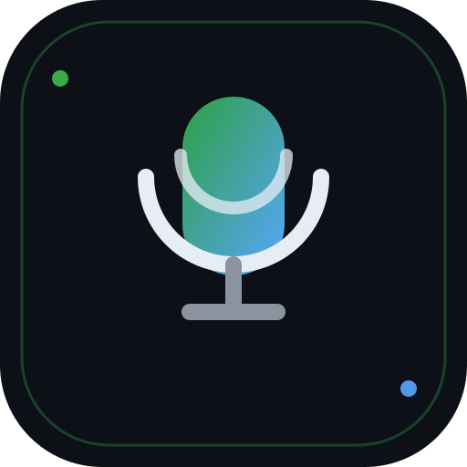
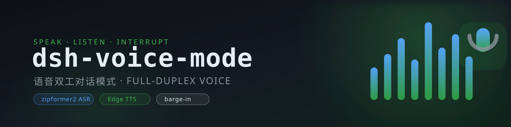

<p align="center">
  
</p>

<p align="center">
  
</p>

<p align="center">
  <a href="#"></a>
  <a href="https://www.npmjs.com/package/dsh-voice-mode"></a>
  <a href="https://github.com/qishuilalala/dsh-voice-mode/releases"></a>
  <a href="LICENSE"></a>
</p>

# dsh-voice-mode

DeepSeek Harness（dsh）语音双工对话插件：会话内一键进入语音模式，边说边出字的流式识别 → 停顿自动发送 → 最终答复按句流式朗读（Edge TTS）+ 实时字幕，开口即可打断（barge-in）。无需 API Key，模型在本地宿主端推理。

> **Full-duplex voice conversation mode for DeepSeek Harness** — streamed ASR to an editable draft, sentence-by-sentence read-aloud with live captions, and speaking interrupts playback and the running turn.

## 功能亮点

- 双交互模式：`toggle` 持续聆听（2 秒自动断句发送）/ `hold` 按住说话（松手即发）
- zipformer2 流式识别（边说边出字），可选唤醒词，可选自动发送
- 按句流式朗读 + 实时字幕 + 提示音；音色可试听（支持自定义 ShortName）
- 打断灵敏度可调，真·开口打断朗读与正在运行的回合
- 模型懒加载（约 160MB，断点续传 + 镜像回退），全局单活

## 安装

```sh
dsh plugin --profile web add dsh-voice-mode
```

bundle 插件安装后需重启 dsh 生效；完整使用说明见 [中文文档](plugin/dsh-voice-mode/README.md) / [English docs](plugin/dsh-voice-mode/README.en.md)。

## 演示


## 文档

| 文档 | 说明 |
| --- | --- |
| [中文 README](plugin/dsh-voice-mode/README.md) | 特性 / 手势 / 设置 / API / 配置 / 故障排查（详细） |
| [English README](plugin/dsh-voice-mode/README.en.md) | 同上（英文版） |
| [发布最佳实践](BEST_PRACTICES.md) | 开发与发布沉淀 |
| [发布检查清单](docs/VERIFICATION.md) | 验证记录 |
| [插件市场条目](docs/publish/awesome-dsh-plugin-entry.yml) | awesome-dsh-plugin / dshmarket 收录条目 |

## 发布状态

- npm：`dsh-voice-mode`（发布后可用）
- GitHub Releases：[v0.1.0](https://github.com/qishuilalala/dsh-voice-mode/releases/tag/v0.1.0)
- 插件市场：awesome-dsh-plugin 收录后 dshmarket 即见

## 贡献

见 [CONTRIBUTING.md](plugin/dsh-voice-mode/CONTRIBUTING.md) 与 [BEST_PRACTICES.md](BEST_PRACTICES.md)。

## License

[MIT](LICENSE)

> 部分实现借鉴 [haoku123/dsh-voice](https://github.com/haoku123/dsh-voice)（派生声明见子包 LICENSE）。

> 插件代码以宿主权限运行，安装前请了解来源与风险（与官方列表一致的安全提示）。
