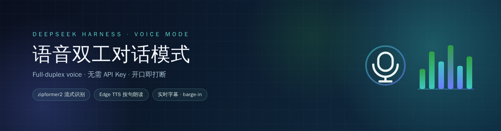
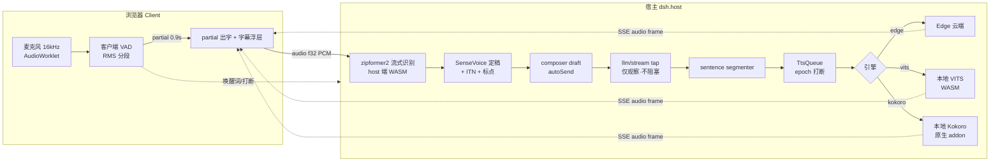
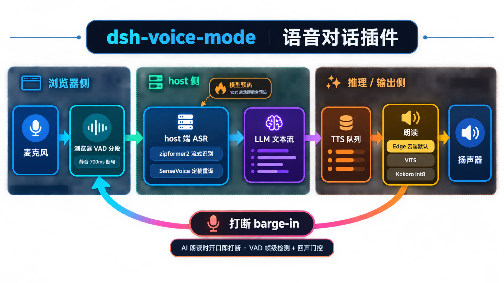

<p align="center">
  
</p>

<h1 align="center">dsh-voice-mode</h1>

<p align="center">DeepSeek Harness 全双工语音插件 —— 边说边出字 · 按句朗读 · 开口即打断</p>

<p align="center">
  <a href="LICENSE"></a>
  <a href="https://github.com/qishuilalala/dsh-voice-mode/releases"></a>
  <a href="https://www.npmjs.com/package/dsh-voice-mode"></a>
  <a href="docs/rules/STATE.md"></a>
</p>



> **Full-duplex voice mode for DeepSeek Harness** —— 在会话内用语音完成整轮对话：说话时**边说边出字**、停顿后自动发送；回复**按句朗读**并跟随实时字幕；朗读中**开口即打断**。识别在本地推理、无需 API Key；朗读默认 Edge 云端（快且自然），本地 VITS / Kokoro 可选（隐私优先）。兼容 dsh 0.1.1-rc.2 起全版本（已在 0.1.1 / 0.1.2 / 0.1.5-rc.1 / 0.1.5-rc.2 端到端验证）。当前版本 **v0.7.7**，254 项测试全绿。

---

## 💡 它是什么

在 DeepSeek Harness 的会话里，点一下麦克风就能用语音完成整轮对话：

- 🎤 **你说** —— 一边说一边**实时出字**（流式识别），停顿约 **1500ms 自动发送**；
- 🔊 **它答** —— 最终回复**按句朗读**，全程实时字幕跟随；
- ⏸️ **随时打断** —— AI 还在朗读时**开口即打断**，你的话直接被听见。

**零 API Key**：识别在宿主端**本地推理**（**zipformer2** 流式 + SenseVoice 定稿）；朗读默认 **Edge 云端**（快、自然），可选本地 **VITS** 纯中文 / **Kokoro** 中英混读（回复文本不出本机，隐私优先）。

---

## 🤔 为什么值得用（5 个真痛点）

| # | 痛点 | 我们的应对 |
| --- | --- | --- |
| 1 | **专有名词识别不对** —— 「dsh-voice-mode」总识别成「DSH voice 模式」 | 识别热词偏置 `asrHotwords: "dsh-voice-mode:2.5"` —— 显著提升专有名词召回 |
| 2 | **语种乱漂** —— 中英混说时句子中途跳英文 / 一锁 en 又跳回中文 | `recognitionLanguage` = `auto/zh/en/ja/ko/yue` 6 语种锁定 + 重建 worker |
| 3 | **字幕看不清** —— 字小、窄屏被输入框挡住 | `captionFontSize` 4 档（12/14/18/24px）+ `captionMaxWidth` 3 档（50/70/90vw） |
| 4 | **让位误打断** —— AI 朗读时插一句「嗯/对」就被硬打断 | `backchannelYield` 让位语义：短词自动让位 1.5s，真要说走才硬打断 |
| 5 | **本地 TTS 太机械** —— 一句话读完停顿 3-5 秒 | 本地 VITS / Kokoro 原生 addon + epoch 队列管理，按句流式朗读、句间无停顿 |

---

## ✨ 功能（按用户价值）

1. 🎙️ **识别准** —— 热词偏置 + SenseVoice 多语种 + ITN（数字/日期/货币自动规范化）
3. 🗣️ **不说错** —— 唤醒词待机、唤醒词前缀语气词白名单（`嗯`/`那个` 不再误触）
5. 🤝 **让位** —— 让位语义 + 三档打断灵敏度（`interruptLevel`），外放也能精准打断
7. 💬 **有感情** —— 本地 Kokoro 103 音色 + Edge 322 音色，行内可试听；分段朗读不漏句
9. 👁️ **字幕 a11y** —— 4 档字号 + 3 档宽度，浅色主题变量跟随 dsh 主题

---

## 🎬 Demo


> 真实录屏见 [`demos/RECORDING-SCRIPT.md`](demos/RECORDING-SCRIPT.md)（60s/30s/15s 三段脚本）。  
> 真机截图清单见 [`screenshots/MANIFEST.md`](screenshots/MANIFEST.md)（12 张）。

---

## 🚀 5 分钟上手（Quick Start）

```sh
dsh plugin --profile web add dsh-voice-mode
systemctl restart dsh   # Linux；其他平台重启 dsh 进程
```

**第一次用**：

1. 进入任一会话，按 `Ctrl+Shift+V`（或点输入区麦克风按钮）进入语音模式，状态条显示「聆听中…」；
2. 说一句完整的话（如「帮我看看今天的天气」）→ 实时字幕立即出现，停顿后自动发送；
3. AI 回复开始朗读时，**开口说话 → 朗读即刻停止，你的话被听见**（这就是 barge-in）。

### 操作手势

| 手势 | 作用 |
| --- | --- |
| `Ctrl+Shift+V` | 进入 / 退出语音模式 |
| 直接说话（toggle） | 边说边出字，停顿 1500ms 自动发送；按住 `Ctrl` 强制立即发送 |
| 按住麦克风按钮（hold） | 松手发送；短按退出；滑出 / `Esc` / 失焦放弃本段 |
| 点输入框旁模式按钮 | 在「持续聆听 ⇄ 按住说」间切换（保存到设置） |
| AI 朗读时开口说话 | 打断朗读并取消当前回合 |
| 点状态条「退出」 | 退出语音模式 |
| 点字幕浮层「跳过」 | 跳过当前句朗读 |


---

## ⚙️ 配置（7 新设置字段 + 5 默认值微调）

**设置 → Plugins → 插件配置 → 语音模式（voice-mode）**。

### 7 新设置字段（11 批次周全修复落地）

| 你想调什么 | 改哪个键 | 默认 | 说明 |
| --- | --- | --- | --- |
| 识别热词 | `asrHotwords` / `asrHotwordsScore` | 空 / `1.5` | 每行一词或「词:分数」（如 `dsh-voice-mode:2.5`）；变更触发 recognizer 重建 |
| 识别语种 | `recognitionLanguage` | `auto` | SenseVoice 多语：`auto` / `zh` / `en` / `ja` / `ko` / `yue`；切换终止并重建 worker |
| 逆文本归一化 | `senseITN` | `true` | SenseVoice 数字/日期/货币规范化（默认开，关掉保留原文） |
| 字幕字号 | `captionFontSize` | `0` | 档位 0=12px / 1=14px / 2=18px / 3=24px |
| 字幕宽度 | `captionMaxWidth` | `1` | 档位 0=50vw / 1=70vw / 2=90vw |
| 让位语义 | `backchannelYield` | `true` | 朗读期说「嗯/对」自动让位 1.5s，真要说走硬打断（ADR-0008） |

### 5 默认值微调（批 J）

| 字段 | 旧 | 新 | 理由 |
| --- | --- | --- | --- |
| `rate` | 1.0 | **1.1** | Edge 默认略慢，统一提速 10% 改善体验 |
| `idleTimeoutMinutes` | 10 | **5** | 空闲退出更灵敏（朗读仍计为活动） |
| `interruptLevel` description | 旧描述 | 新描述 | 明确「3/2/1 帧确认」机制 |

> 字段名零变化，旧 `~/.dsh/settings.yaml` 100% 兼容。

完整 19 项设置表见 [plugin/dsh-voice-mode/README.md](plugin/dsh-voice-mode/README.md#%E8%AE%BE%E7%BD%AE%E8%AE%BE%E7%BD%AE--plugins--%E6%8F%92%E4%BB%B6%E9%85%8D%E7%BD%AE--%E8%AF%AD%E9%9F%B3%E6%A8%A1%E5%BC%8F)。

---

## 🏛️ 架构（Architecture）





详细架构决策：见 [`docs/adr/`](docs/adr/README.md) 8 个 ADR。

---

## 🔍 与 dsh 内置语音模式对比

| 维度 | dsh 内置 | dsh-voice-mode（本插件） |
| --- | --- | --- |
| 识别模型 | 云端 API（需 key） | **本地 zipformer2 + SenseVoice**（零 key） |
| 多语种 | 英文为主 | **6 语种 auto/zh/en/ja/ko/yue + ITN** |
| 朗读引擎 | 云端 TTS | **Edge 云端 + 本地 VITS/Kokoro** 三选一 |
| 打断检测 | 基础 VAD | **三档灵敏度 + 回声门控 + 让位语义** |
| 热词偏置 | 无 | **sherpa-onnx 热词 + 偏置分** |
| 字幕 a11y | 无 | **4 档字号 + 3 档宽度 + 主题跟随** |
| 唤醒词 | 无 | **轻量流式匹配 + 前缀语气词白名单** |
| 兼容 dsh | — | **0.1.1-rc.2 → 0.1.5-rc.2 全版本** |

---

## 🛠️ 故障排查

| 现象 | 处理 |
| --- | --- |
| 点麦克风无反应，状态条红字 | 浏览器拒绝麦克风：地址栏（iOS 为 设置 → Safari → 麦克风）开启后重试 |
| 状态条「正在加载模型… x%」卡住 | 检查网络；模型较大可先 `npm run prefetch`；国内网络 `modelHost` 配 `https://hf-mirror.com` |
| 朗读无声音 / 无字幕 | 本地引擎首次合成需加载模型；若持续失败看状态条提示（自动退避重试）；确认页面前台且未静音 |
| 语音模式进不去 | 检查插件 `enabled`；多标签页时确认当前会话为活动会话 |
| 识别到但不是我要说的 | 环境噪声：降低音量或提高 `interruptLevel`（高门槛） |
| 打不断（朗读中开口无反应） | 调高 `interruptLevel`（更敏感档）或检查麦克风权限；**不要**调 `echoGateDb`——原生 AEC 生效时它从未被执行（详见 ADR-0006） |
| 热词不生效 | 检查 `asrHotwords` 是否为空（空 = 关闭）；热词变更触发 recognizer 重建，下次进入语音模式生效；热词评分过低（<1.0）几乎无效，建议 ≥1.5 |
| 字幕被输入框挡住 | 默认 `captionMaxWidth=1`（70vw）+ `captionFontSize=0`（12px）在窄屏可能与底部输入框重叠；调整档位，或关闭语音模式后点状态条浮层右上角「×」收起 |
| 让位行为异常（朗读期说「嗯」不停 / 真话被打断） | 「嗯/对」类短词触发让位 1.5s（hold）后继续朗读；继续说真话会走硬打断；如不要让位语义把 `backchannelYield` 关闭即可恢复改造前行为（ADR-0008） |
| 朗读期说「嗯」没让位 | 确认 `backchannelYield=true`（默认开）；hold 模式松手后让位 1.5s 内继续说话会变硬打断 |
| 空闲 5 分钟自动退出（不想退） | 调高 `idleTimeoutMinutes`（默认 5 分钟，**朗读计为活动**） |

> **已知限制**：`Ctrl+Shift+V` 会覆盖浏览器「粘贴纯文本」快捷键（普通粘贴仍用 `Ctrl+V`）；识别为简体中文优先；**Safari / iOS** 需 HTTPS 或 localhost、首次需授权麦克风、后台 / 锁屏会暂停识别与朗读。

---

## 🛣️ 路线图（Roadmap）

完整 backlog（43 项 P0-P3）见 [`docs/competitive/backlog.md`](docs/competitive/backlog.md)。

- ✅ **已完成（v0.7.7）**：11 批次周全修复（识别热词 / 锁语种 / 字幕档位 / 让位语义 / 模型预热 / 默认值微调 / 死代码清理等）
- 🚧 **P0（近期）**：ADR-0003 VAD 下沉 / ADR-0006 第一级探测接通 manual / F1 emotion DSL 全量上线
- 📋 **P1（中期）**：MCP `voice_*` 工具集 / 卡片表单 draft validate / 状态条 idle 优化
- 💡 **P2（远期）**：声音克隆（用户已决定推迟）/ ADR-0004 WebSocket transport
- ⏸️ **已推迟**：xAI fallback / C1 人格层（用户已决定推迟）

---

## 📚 文档

| 文档 | 说明 |
| --- | --- |
| [完整使用说明（中文）](plugin/dsh-voice-mode/README.md) | 功能 / 手势 / 设置 / 配置 / 已知限制 / 故障排查 |
| [English docs](plugin/dsh-voice-mode/README.en.md) | Same, in English |
| [docs/ 索引](docs/README.md) | 架构决策 / 实施计划 / 真机验收 / 规则 / 调研 / 竞品 |
| [60 天迭代博客](blog/2026-09-15-eleven-batches-evolution.md) | 从 91 到 254 项测试的故事 |
| [CHANGELOG.md](CHANGELOG.md) | Keep a Changelog 格式 |
| [RELEASE-NOTES.md](RELEASE-NOTES.md) | 60 天时间线 |

---

## 🤝 Contributing / 📄 License / 🙏 Acknowledgments

**License**: [MIT](LICENSE)

**Contributing**: PR 欢迎，但请先读 [`docs/adr/`](docs/adr/README.md) 8 个 ADR + [`CONTEXT.md`](CONTEXT.md) + [`docs/rules/STATE.md`](docs/rules/STATE.md)；仓库遵循 [CLAUDE.md](CLAUDE.md) 的维护纪律（CLAUDE.md / AGENTS.md 仅存本机，不入库）。

**Acknowledgments**：

- 上游：[haoku123/dsh-voice](https://github.com/haoku123/dsh-voice)（派生声明见子包 LICENSE）
- 核心依赖：[sherpa-onnx](https://github.com/k2-fsa/sherpa-onnx)（Apache-2.0，本地 ASR / VITS / Kokoro 推理）/ [msedge-tts](https://github.com/litmonkey-labs/msedge-tts)（Edge 云端 TTS）
- 测试支持：[awesome-dsh-plugin](https://github.com/awesome-dsh-plugin/awesome-dsh-plugin)（收录到精选列表）
- 11 批次周全修复参与贡献者：见 [`docs/rules/STATE.md`](docs/rules/STATE.md) § 批次进度表

---

> 📌 **项目维护**：仓库遵循「外科手术式改动」纪律 —— 不顺手优化、不重构无关代码、不强推发布历史；每个 commit 单一职责，便于审查与回滚。详见 [`CONTEXT.md`](CONTEXT.md)。