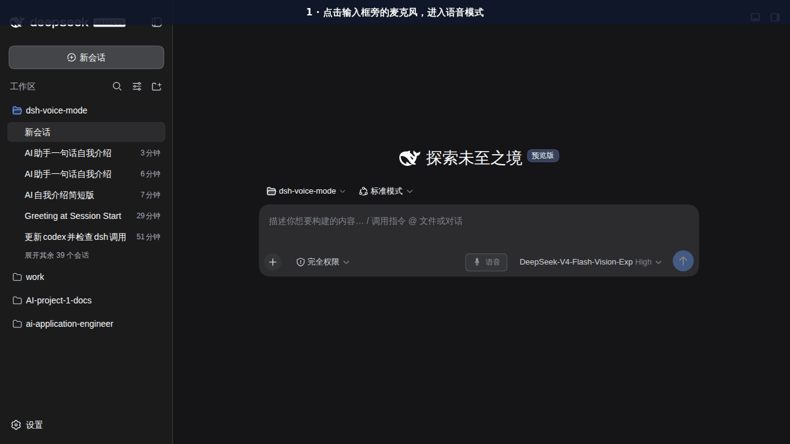
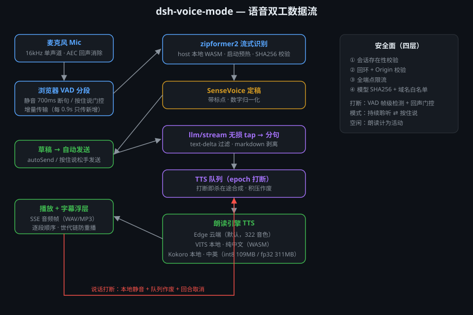

# dsh-voice-mode

[](https://www.npmjs.com/package/dsh-voice-mode)
[](LICENSE)
[](https://github.com/topics/dsh-plugin)

> Full-duplex voice conversation mode for DeepSeek Harness (dsh): speak, get a
> spoken answer. Streamed zipformer2 ASR → editable draft → auto send → the
> final reply is read out sentence-by-sentence via Edge TTS, and your voice
> interrupts playback and the running turn. No API key.

DeepSeek Harness 语音双工对话模式：会话内一键进入 → 边说边出字的流式识别 → 停顿自动发送 → 最终答复按句流式朗读 + 实时字幕，开口即可打断（真 barge-in）。无需 API Key，模型在本地宿主端推理。



## 特性

- **语音模式**：输入框工具排麦克风按钮或全局快捷键 `Ctrl+Shift+V` 进入/退出；全局单活（同一时刻仅一个会话处于语音模式，切换会话自动让出）
- **两种交互模式（设置可切换）**：
  - `toggle`（默认）持续聆听：RMS VAD 分段 → zipformer2 流式识别（边说边出字，实时字幕预览）→ 静音 2 秒自动断句进草稿并自动发送；按住 `Ctrl` 强制立即发送
  - `hold` 按住说话：短按进入/退出，**按住麦克风按钮说话、松手即发**（滑出取消、`Esc`/失焦放弃本段）；`Ctrl` 按住即录、松开即发
- **唤醒词（可选，默认关）**：设置 `wakeWord` 后，进入语音模式处于待机态，说出唤醒词才开始识别（如「你好小D」），避免误触
- **输出链路**：只朗读最终答复的 `text-delta`（reasoning/工具调用不读），按句流式 Edge TTS 朗读 + 右下角实时字幕浮层；工具调用触发提示音；全文照常写入聊天记录
- **开口打断（barge-in）**：三档灵敏度的发声前沿检测 → 本地静音 + host 合成队列作废（epoch）+ 正在运行的回合取消（保留半截并自然续入你的新消息）
- **模型懒加载与进度**：首次使用自动下载 zipformer2 中文流式模型（约 160MB，`.part` 断点续传），状态条实时显示下载进度；可用 `npm run prefetch` 预下载
- **容错**：麦克风被拒红点提示、模型下载失败可见提示、TTS 连接失败状态条提示（自动重试）、提交失败文字留在草稿、SSE 断线自动重连
- **设置**：设置 → 插件配置 → voice-mode，可调音色 / 语速 / 打断灵敏度 / 静音停顿 / 空闲超时 / 模型镜像 / 自动发送 / 交互模式 / 唤醒词
- **空闲退出**：10 分钟无活动自动退出并释放麦克风

## 操作手势

| 手势 | 行为 |
| --- | --- |
| 点按麦克风按钮 / `Ctrl+Shift+V` | 进入 / 退出语音模式 |
| 直接说话，停顿 2 秒（toggle） | 自动断句并发送 |
| 按住 `Ctrl`（toggle，≥250ms 语音） | 强制立即发送当前段 |
| **按住麦克风按钮（hold）** | 按住说话，松手发送；向上滑出 / `Esc` / 失去焦点放弃本段；<250ms 短按退出模式 |
| 按住 `Ctrl`（hold，≥600ms） | 键盘按住说话，松开即发 |
| 先喊一声唤醒词（已配置） | 从待机激活为聆听（其后才识别与发送） |
| AI 朗读时开口说话 | 打断朗读并取消当前回合 |
| 在输入框打字 | 自动退出语音模式（草稿保留） |

## 安装

**要求**：dsh web（Node ≥ 18），现代浏览器（Chrome / Edge / Firefox，需支持 `getUserMedia` 与 Web Audio）。

```sh
# 方式一：从 npm 安装（推荐）
dsh plugin --profile web add dsh-voice-mode
# 等价形式（本机未装 dsh CLI 时由 npx 临时拉起）：
npx -y @deepseek-ai/dsh plugin --profile web add dsh-voice-mode

# 方式二：本地 tarball
dsh plugin --profile web add ./dsh-voice-mode-0.1.0.tgz

# 方式三：从源码安装
git clone https://github.com/qishuilalala/dsh-voice-mode.git
cd dsh-voice-mode/plugin/dsh-voice-mode && pnpm install && pnpm build
dsh plugin --profile web add .
```

**bundle 插件需重启 dsh 生效**（不同平台的重启方式）：

- **Linux（systemd）**：`systemctl restart dsh`
- **Windows / macOS / 手动托管**：重启你的 dsh 进程（结束进程后重新 `dsh web`，或在其服务管理器中重启）

**可选**：预下载 ASR 模型，让首次进入语音模式零等待：

```sh
npm run prefetch          # 插件目录内执行；默认写到平台缓存目录
# 或指定缓存位置：node scripts/prefetch.mjs --cache-dir /where/ever/models
```

## 使用

1. 点击输入框工具排的麦克风按钮（或按 `Ctrl+Shift+V`）进入语音模式，输入框上方出现状态条
2. 说话方式二选一：直接说、停顿 2 秒自动发送（toggle）；或按住麦克风按钮、松手发送（hold）
3. AI 回复逐句朗读，右下角浮层显示字幕；点「跳过」或直接开口打断
4. 点状态条「退出」（或再按 `Ctrl+Shift+V`）退出语音模式

首次进入会下载识别模型，状态条显示 `正在加载模型… <文件> <百分比>%`。

配置了唤醒词时，进入后会先处于待机态（状态条提示「说『唤醒词』开始」），说完唤醒词即激活。

## 设置（设置 → Plugins → 插件配置 → 语音模式）

| 键 | 默认 | 说明 |
| --- | --- | --- |
| `voice` | `zh-CN-XiaoxiaoNeural` | Edge TTS 音色（见下方常用音色表），**即时生效** |
| `rate` | `1.0` | 朗读语速倍率（0.5 慢速 ～ 2.0 快速），**即时生效** |
| `interruptLevel` | `0` | 发声打断灵敏度：0 高门槛 / 1 中 / 2 低 |
| `silenceMs` | `2000` | 说完整一句的静音停顿毫秒数 |
| `idleTimeoutMinutes` | `10` | 无活动自动退出语音模式的分钟数 |
| `modelHost` | 默认源 | ASR 模型下载源（国内网络填 `https://hf-mirror.com`） |
| `autoSend` | `true` | 识别定稿后自动发送；关闭则只进草稿（按住 `Ctrl` / hold 松手仍会发送） |
| `mode` | `toggle` | 交互模式：`toggle` 持续聆听 + 2s 静音断句；`hold` 按住说话、松手发送（短按退出） |
| `wakeWord` | 空（关） | 唤醒词（如「你好小D」）：进入后先说唤醒词激活，避免误触；空 = 关闭 |

生效范围：`voice`/`rate` 修改后**立即生效**（TTS 热切换）；其余设置下次进入语音模式时生效。设置项默认值由插件配置（`base` 层）提供——未显式修改时跟随配置。

### 常用音色（完整清单见 `node scripts/list-voices.mjs`）

| ShortName | 说明 |
| --- | --- |
| `zh-CN-XiaoxiaoNeural` | 晓晓 · 女声（默认） |
| `zh-CN-XiaoyiNeural` | 晓伊 · 女声 |
| `zh-CN-YunxiNeural` | 云希 · 男声 |
| `zh-CN-YunjianNeural` | 云健 · 男声 |
| `zh-CN-YunyangNeural` | 云扬 · 男声 |
| `zh-CN-YunxiaNeural` | 云夏 · 男声 |
| `zh-CN-liaoning-XiaobeiNeural` | 小北 · 东北话 · 女声 |
| `zh-CN-shaanxi-XiaoniNeural` | 小妮 · 陕西话 · 女声 |
| `zh-HK-HiuMaanNeural` | 晓曼 · 粤语 · 女声 |
| `zh-TW-HsiaoYuNeural` | 小雨 · 台湾腔 · 女声 |
| `en-US-AriaNeural` | Aria · 英语 · 女声 |
| `en-US-GuyNeural` | Guy · 英语 · 男声 |

## 配置（bundle patch / settings.yaml）

也可直接编辑 `~/.dsh/settings.yaml` 的 `voice-mode:` 段（GUI 卡片与 RPC 写入同一文档层）：

```yaml
- id: voice-mode
  name: dsh-voice-mode
  config:
    enabled: true
    basePath: /voice-mode
    cacheDir: ~/.cache/dsh-voice-mode/models   # 可覆盖；默认按平台
    # 以下为设置项的默认播种值（设置面板可覆盖；最终生效值以设置面板为准）：
    voice: zh-CN-XiaoxiaoNeural
    rate: 1.0
    interruptLevel: 0
    silenceMs: 2000
    idleTimeoutMinutes: 10
    modelHost: https://huggingface.co
```

> 说明：`voice/rate/interruptLevel/silenceMs/idleTimeoutMinutes/modelHost/autoSend`
> 的最终生效值以**设置面板**为准；bundle 配置仅为这些键提供默认播种值
> （`enabled/basePath/cacheDir` 仍只由 bundle 配置控制）。

## API

| 路由 | 说明 |
| --- | --- |
| `GET /voice-mode/stream` | SSE：`event: audio`（`{sessionId, seq, text, audio(base64 MP3)}`）、`event: mode`（全局单活归属）、`event: tool`（提示音）、`event: asr-progress / asr-ready / asr-error / tts-error` |
| `POST /voice-mode/toggle` | `{sessionId, on}` 进入/退出语音模式（全局单活） |
| `POST /voice-mode/asr` | 原始 f32 LE 16k PCM 载荷 → `{text}`（流式 zipformer2）；模型未就绪返回 `202 {loading}`；`?reset=1` 丢弃进行中识别段（唤醒词命中清场用） |
| `POST /voice-mode/cancel` | `{sessionId}` 作废 TTS 队列并丢弃在途 ASR 段 |
| `GET /voice-mode/config` | 客户端引导参数（静音阈值 / 灵敏度 / 音色语速等） |
| `GET /voice-mode` | 健康检查 `{ok, name, enabled, active}` |

## 模型与缓存

- 识别模型：`csukuangfj/sherpa-onnx-streaming-zipformer-zh-int8-2025-06-30`（encoder ≈154MB / decoder / joiner / tokens，共约 160MB），宿主端 sherpa-onnx（Node WASM，Apache-2.0，天然跨平台）
- 缓存目录默认值按平台：
  - **Windows**：`%LOCALAPPDATA%\dsh-voice-mode\models`
  - **macOS / Linux**：`~/.cache/dsh-voice-mode/models`
  - 均可通过 `cacheDir` 配置覆盖
- 下载走 `.part` 断点续传，`huggingface.co` 失败自动回退 `hf-mirror.com`（可配置 `modelHost`）

## 工作原理



```
input:  mic ──RMS VAD（2s 静音切句）──▶ POST /voice-mode/asr（f32 PCM，16k，增量解码）
                                           │ zipformer2 流式识别（宿主端 WASM）
                                           ▼
        composer draft ──autoSend──▶ model stream ──llm/stream tap（仅活跃语音会话）
                                           │ text-delta 过滤 → 句子切分
                                           ▼
        browser ◀── SSE /voice-mode/stream ◀── TtsQueue（msedge-tts 逐句合成）
```

- 语音与朗读只发生在全局单活指针 `activeVoiceSession` 指定的会话；普通会话 `llm/stream` 直达、零开销（模式隔离）
- `llm/stream` tap 无损：每个 chunk 原样透传，切句/合成只旁观，不阻塞模型流
- zipformer2 在宿主端推理（sherpa-onnx Node WASM），浏览器只负责采集（`getUserMedia` 16k 单声道）与端点检测
- TTS 队列按会话隔离 + epoch 版本号：打断后旧帧全部作废，真正静音

## 已知限制

- 发声打断依赖浏览器回声消除（`echoCancellation`）；扬声器音量过大时可能漏声到麦克风（JS 层无法做 AEC）
- `Ctrl+Shift+V` 会覆盖浏览器「粘贴纯文本」快捷键（普通粘贴仍可用 `Ctrl+V`）
- 识别模型为简体中文优先；识别质量受环境噪声影响
- 浏览器自动播放策略：朗读需要页面已有用户交互（点击麦克风即满足）；若浏览器拦截播放且状态条无提示，请确认网页处于前台且非静音状态
- **唤醒词为轻量实现**（基于流式识别文本匹配，非专用 KWS 引擎）：嘈杂环境可能延迟或误激活；唤醒词本身不会进入聊天（命中即丢弃缓冲）
- hold 模式按住时如果切换窗口/标签页会**放弃本段**（防持续收音），回来需重新按住
- hero（新会话空态）没有语音入口：语音模式是会话级功能，请先进入会话使用输入框麦克风按钮

## 故障排查

| 现象 | 处理 |
| --- | --- |
| 点麦克风无反应，状态条提示红字 | 浏览器拒绝了麦克风权限：地址栏允许麦克风后重试 |
| 状态条显示「正在加载模型… x%」卡住 | 检查网络；模型大（160MB）可先 `npm run prefetch`；国内网络把 `modelHost` 配成 `https://hf-mirror.com` |
| 状态条显示「语音模型下载失败」 | 两镜像均不可达：检查网络/代理后重新进入语音模式（断点续传） |
| 有字幕（浮层）但听不到声音 | 检查系统音量/输出设备；浏览器自动播放被拦时点击页面任意处后再试 |
| 状态条显示「朗读连接失败：正在重试…」 | Edge TTS 服务不可达（境外服务），稍后自动重试；持续失败请检查网络/代理 |
| 识别不准 | 靠近麦克风、降低环境噪声；还有回声时把「打断灵敏度」调高一档 |
| hold 模式按住没反应 | 确认切换到了 hold 模式并处于语音模式中（按钮显示「按住说话」）；浏览器窗口需在前台 |

## 开发

### 依赖版本纪律（重要）

`package.json` 中 `@deepseek-ai/schemastery`、`dsh-settings`、`dsh-host-webserver`、`dsh-llm`
的版本**必须与当前 dsh 运行时一致**（本机 dsh 0.1.1-rc.2 对应 `^0.1.1-rc.2` / schemastery
`^3.18.1`）。写低于运行时的 registry 版本会被 pnpm 解析装进 profile 并导致
`webServer` 等服务缺失、相关插件全部 pending 的崩溃循环。升级 dsh 时须同步这四个版本。

## 开发

```sh
pnpm install && pnpm build    # esbuild：lib/index.js（host）+ lib/client.js（browser）
pnpm test                     # segmenter/wakeword 单测 + 发布前自检（均无需网络）
node test/hold-e2e.js         # hold 模式验收（独立浏览器，/asr 路由拦截）
systemctl restart dsh         # Linux；其他平台重启 dsh 进程
```

结构：

```
src/index.ts      host：单活指针、llm/stream tap、SSE、settings 注册
src/asr-host.ts   host：zipformer2 流式识别 + 模型懒下载（.part 断点续传）
src/tts-queue.ts  host：逐会话 TTS 队列 + epoch 打断机制
src/segmenter.ts  host：句子切分（markdown 剥离 + 终止标点）
src/client.tsx    client：麦克风按钮 + 状态条 + 朗读浮层 + 打断
src/asr.ts        client：getUserMedia + RMS VAD + partial 轮询
scripts/prefetch.mjs  模型预下载（跨平台缓存目录 + 断点续传）
test/segmenter.test.mjs 句子切分单元测试
test/wakeword.test.mjs    唤醒词匹配单元测试
test/verify-client.mjs   发布前自检（bundle 清单/导出/形状）
test/hold-e2e.js          hold 模式端到端验收（独立浏览器）
scripts/list-voices.mjs   打印 Edge TTS 全部音色（音色表来源）
```

发布与精选列表提交流程见仓库根 `BEST_PRACTICES.md` 与 `docs/publish/`。

## 许可

MIT